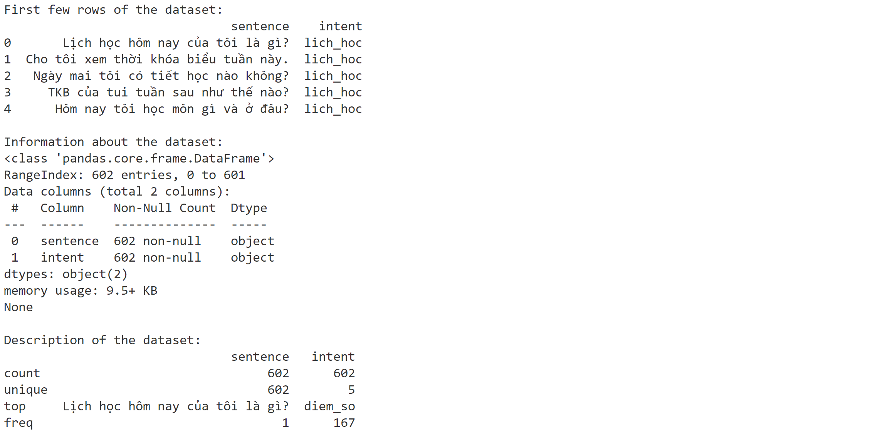
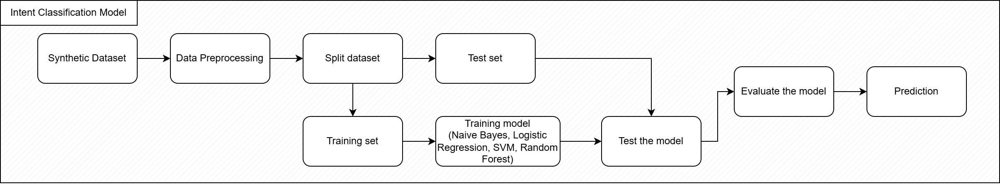

# Intent Classification for FAP Chatbot

## I. Giới thiệu

FPT Academic Portal đóng vai trò trung tâm trong đời sống học thuật của sinh viên, cung cấp các thông tin quan trọng như thời khóa biểu, lịch thi, điểm số và các thông báo từ nhà trường. Mặc dù là một công cụ mạnh mẽ, giao diện truyền thống của FAP đòi hỏi người dùng phải thực hiện nhiều bước để tìm kiếm thông tin cụ thể, dẫn đến tốn thời gian và đôi khi gây bất tiện. Sinh viên thường có những câu hỏi lặp đi lặp lại và mong muốn có một phương thức truy cập thông tin nhanh chóng, tự nhiên hơn.

Để giải quyết vấn đề này, dự án "Bạn Cóc" được đề xuất nhằm xây dựng một chatbot có khả năng hiểu ngôn ngữ tự nhiên với tiếng Việt và tự động phân loại yêu cầu của sinh viên thành các ý định tương ứng với các chức năng trên FAP.

## II. PHƯƠNG PHÁP LUẬN

Pipeline của dự án được xây dựng theo các bước chuẩn của một bài toán xử lý ngôn ngữ tự nhiên (NLP), từ xây dựng dataset, tiền xử lý, trích xuất đặc trưng đến huấn luyện và đánh giá mô hình.

**A. Dataset Curation**

Do không có sẵn bộ dữ liệu công khai cho tác vụ này, dữ liệu sẽ được tạo ra dưới dạng synthetic data. Bộ dữ liệu này gồm các câu hỏi do mô phỏng, phản ánh các tình huống thực tế mà sinh viên có thể hỏi chatbot, và được gán nhãn với 5 loại ý định chính:

* `lich_hoc`: Các câu hỏi liên quan đến thời khóa biểu hàng tuần (thời gian, địa điểm, giảng viên).
* `lich_thi`: Các câu hỏi về lịch thi (ngày thi, phòng thi, hình thức thi).
* `diem_danh`: Các câu hỏi về tình trạng chuyên cần, số buổi vắng mặt.
* `diem_so`: Các câu hỏi về điểm thi, điểm thành phần, điểm tổng kết và GPA.
* `hoc_phi`: Các câu hỏi về học phí môn học.

**B. Pipeline**

*1) Preprocessing:* Nhằm chuẩn hóa và làm sạch dữ liệu văn bản thô.

* **Chuẩn hóa Unicode:** Chuẩn hóa văn bản về dạng Unicode để tránh các vấn đề về mã hóa.
* **Chuyển về chữ thường:** Chuyển toàn bộ văn bản về dạng chữ thường (lowercase).
* **Loại bỏ các dấu:** Loại bỏ các dấu thanh, dấu mũ, dấu sắc, dấu huyền, dấu ngã, dấu nặng.
* **Loại bỏ stopwords:** Các từ không mang nhiều ý nghĩa (như 'của', 'tôi', 'là'...) được loại bỏ để giảm nhiễu.
* **Word segmentation:** Câu được tách thành các từ có nghĩa.

*2) Feature Extraction:*

Các câu đã được tiền xử lý được chuyển đổi thành vector số học bằng phương pháp **TF-IDF (Term Frequency-Inverse Document Frequency)**. TF-IDF đánh giá tầm quan trọng của một từ trong một câu dựa trên tần suất xuất hiện của nó trong câu đó và tần suất nghịch đảo của nó trong toàn bộ tập dữ liệu. Phương pháp này hiệu quả trong việc làm nổi bật các từ khóa đặc trưng cho từng ý định.

*3) Target Variable Encoding:*

Biến mục tiêu `intent` sẽ được mã hoá bằng **LabelEncoder** để đảm bảo yêu cầu đầu ra của mô hình Machine Learning. 

*4) Training & Classification:*

Dữ liệu được chia thành tập huấn luyện (80%) và tập kiểm thử (20%). Các vector TF-IDF từ tập huấn luyện được sử dụng để đào tạo bốn mô hình Machine Learning:
* Random Forest
* Logistic Regression
* Support Vector Machine (SVM)
* Multinomial Naive Bayes

Sau khi huấn luyện, mô hình tốt nhất sẽ được sử dụng để dự đoán ý định cho các câu hỏi mới.

## III. KẾT QUẢ VÀ PHÂN TÍCH

**A. Thiết lập thực nghiệm**

| Mô hình | Precision | Recall | F1-Score | Accuracy |
| :--- | :---: | :---: | :---: | :---: |
| Multinomial Naive Bayes | 0.922 | 0.917 | 0.916 | 0.917 |
| Logistic Regression | 0.976 | 0.975 | 0.975 | 0.975 |
| Support Vector Machine | 0.969 | 0.967 | 0.967 | 0.967 |
| Random Forest | 0.952 | 0.95 | 0.95 | 0.95 |

**B. Kết quả hiệu suất**

Mô hình tốt nhất là Logistic Regression có độ chính xác 0.975 với các siêu tham số tốt nhất. Tuy nhiên, độ chính xác của các mô hình khác cũng khá cao, đặc biệt là Support Vector Machine với độ chính xác 0.967.

## IV. KẾT LUẬN VÀ HƯỚNG PHÁT TRIỂN

**A. Kết luận**

Dự án đã thành công trong việc xây dựng một pipeline hoàn chỉnh để phân loại ý định người dùng cho chatbot FAP. Với việc sử dụng các kỹ thuật NLP cơ bản cho tiếng Việt và các mô hình Machine Learning, dự án đã đạt được độ chính xác tốt trong phân loại ý định.

**B. Hướng phát triển trong tương lai**

Để tiếp tục cải thiện và mở rộng hệ thống, các hướng phát triển sau đây được đề xuất:

- **Mở rộng và cân bằng Dataset:** Bổ sung thêm nhiều mẫu câu cho mỗi ý định, đặc biệt là các câu có cấu trúc phức tạp hoặc dễ gây nhầm lẫn. Sử dụng các kỹ thuật tăng cường dữ liệu (Data Augmentation) như thay thế từ đồng nghĩa hoặc back-translation.
- **Cải thiện biểu diễn văn bản:** Thử nghiệm với các kỹ thuật Word Embeddings (như Word2Vec, FastText) hay các mô hình Transformer như PhoBERT để cho ra embedding tốt hơn theo ngữ cảnh.